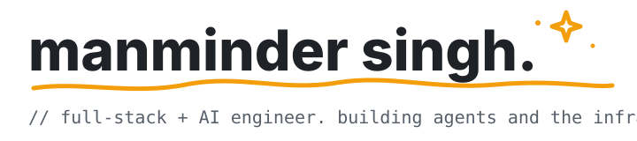

  

 

<table>
<tr>
<td width="80" align="center" valign="top">
  
</td>
<td valign="top">

### currently

head of technology at **[codepup.ai](https://codepup.ai)** — building an AI website builder with multi-LLM orchestration over claude, openai, and gemini.

</td>
</tr>
</table>

<table>
<tr>
<td width="80" align="center" valign="top">
  
</td>
<td valign="top">

### things i've been making

**[mini-claude-code](https://github.com/manmindersingh01/mini-bot)** &nbsp; cli coding agent. ~3k loc, no agent framework, ast edits via ts-morph.

**[jarvis](https://github.com/manmindersingh01/jarvis)** &nbsp; voice assistant for macos. local wake word + whisper + claude agent sdk + mcp memory.

**[waypoint mcp server](https://github.com/manmindersingh01/Waypoint_Challenge)** &nbsp; mcp server that adapts lesson plans to a student's iep. 85 tests, real architectural thesis.

**[worker](https://github.com/manmindersingh01/Worker)** &nbsp; chat-with-pdf rag. pinecone, 0.7 cosine gate, streaming via vercel ai sdk. &nbsp;[live →](https://worker-mocha.vercel.app)

**[calze](https://github.com/manmindersingh01/calze)** &nbsp; calendly clone with real google-calendar conflict detection via nylas. &nbsp;[live →](https://calze.vercel.app)

</td>
</tr>
</table>

<table>
<tr>
<td width="80" align="center" valign="top">
  
</td>
<td valign="top">

### ping me

`bewithme2407@gmail.com` &nbsp;·&nbsp; nit jalandhar, b.tech 2026 &nbsp;·&nbsp; open to remote
 
looking for **AI engineer** / **LLM infrastructure** roles.

</td>
</tr>
</table>
